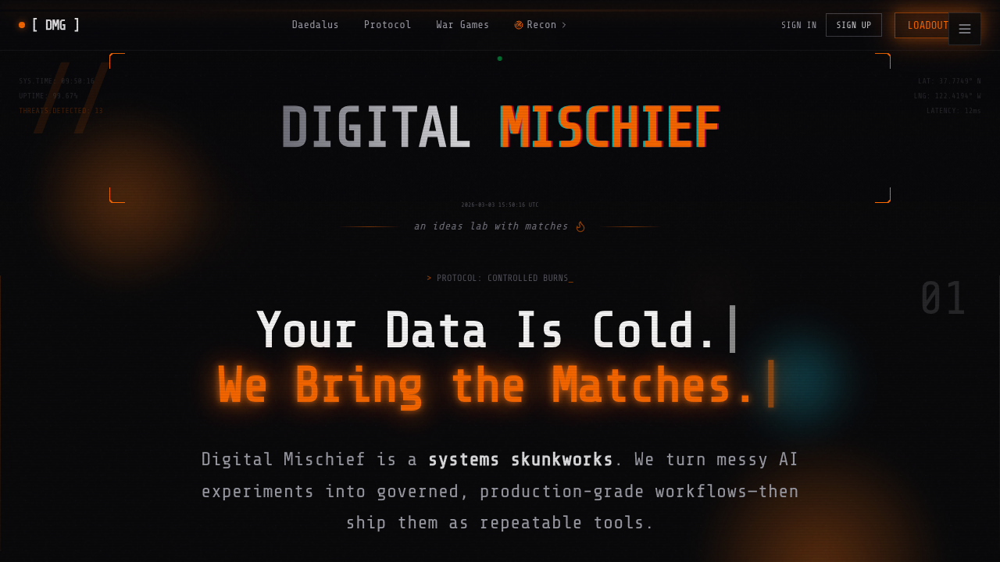
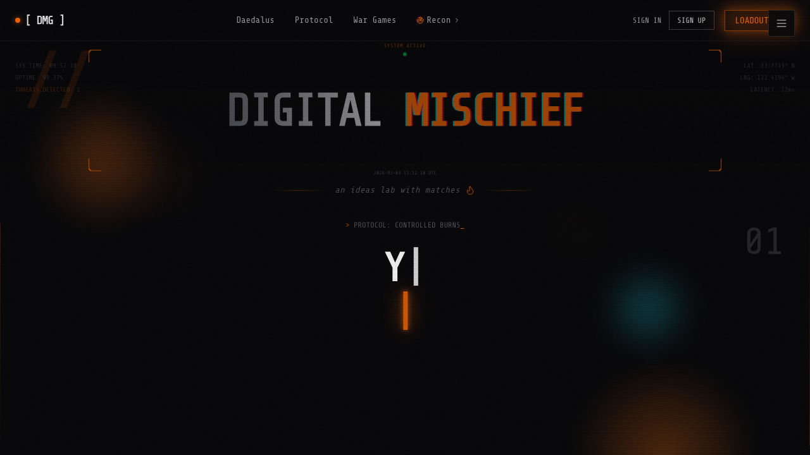
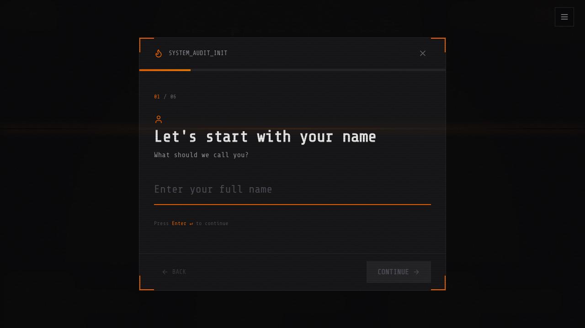
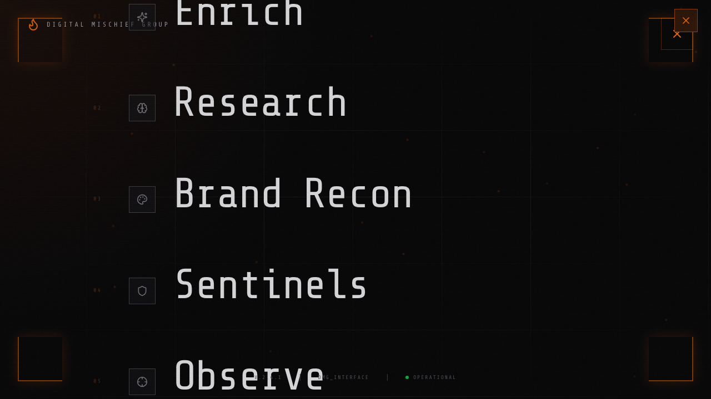
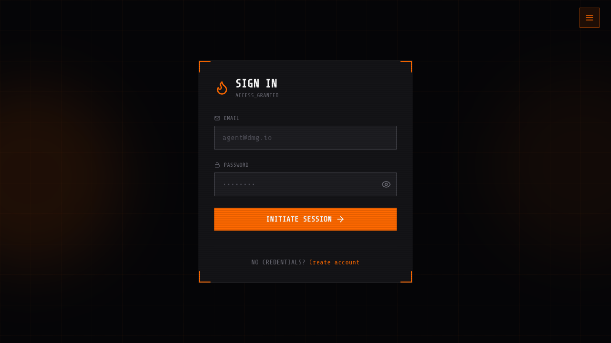
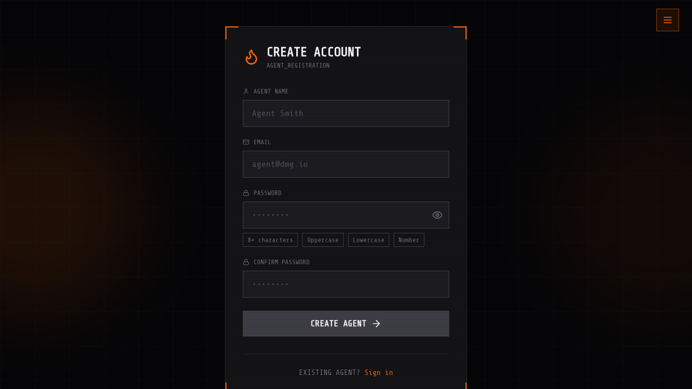

# Dogfood Report: Digital Mischief Group (Production)

| Field | Value |
|-------|-------|
| **Date** | 2026-03-03 |
| **App URL** | https://www.digitalmischiefgroup.com |
| **Session** | digitalmischiefgroup-com-prod |
| **Scope** | Production smoke + core user flows |

## Summary

| Severity | Count |
|----------|-------|
| Critical | 0 |
| High | 0 |
| Medium | 3 |
| Low | 1 |
| **Total** | **4** |

## Issues

<!-- Add ISSUE blocks below as findings are discovered. -->

### ISSUE-001: KaTeX stylesheet blocked by SRI mismatch on page load

| Field | Value |
|-------|-------|
| **Severity** | medium |
| **Category** | console |
| **URL** | https://www.digitalmischiefgroup.com/?qa_sri_check=1 |
| **Repro Video** | N/A |

**Description**

On initial load, the browser logs an integrity error for `katex.min.css`, and the stylesheet is blocked. This can cause unstyled math/content whenever KaTeX-rendered UI is shown.

Observed console error:

`Failed to find a valid digest in the 'integrity' attribute for resource 'https://cdn.jsdelivr.net/npm/katex@0.16.0/dist/katex.min.css' ... The resource has been blocked.`

**Repro Steps**

1. Navigate to `https://www.digitalmischiefgroup.com/?qa_sri_check=1`
   

2. Check browser console/logs via `agent-browser --session digitalmischiefgroup-com-prod errors`
   **Observe:** SRI integrity mismatch blocks the KaTeX stylesheet request.

---

### ISSUE-002: Background navigation can be opened while audit modal is active

| Field | Value |
|-------|-------|
| **Severity** | medium |
| **Category** | ux |
| **URL** | https://www.digitalmischiefgroup.com |
| **Repro Video** | videos/issue-002-repro-v2.webm |

**Description**

When the **Request Audit** modal is open, the global navigation toggle is still clickable. This allows users to open fullscreen navigation and dismiss the modal flow unexpectedly instead of staying in a modal focus context.

**Repro Steps**

1. Navigate to `https://www.digitalmischiefgroup.com`
   

2. Click `[ REQUEST AUDIT ]` to open the modal.
   

3. Click the top-right menu button (`Open navigation menu`).
   

4. **Observe:** Fullscreen navigation opens even though modal flow was active.
   

---

### ISSUE-003: Password visibility toggle button has no accessible name on sign-in

| Field | Value |
|-------|-------|
| **Severity** | medium |
| **Category** | accessibility |
| **URL** | https://www.digitalmischiefgroup.com/sign-in |
| **Repro Video** | N/A |

**Description**

The password visibility icon button in the sign-in form renders without an accessible label, so assistive tech cannot announce what the control does.

Observed accessibility snapshot output:

`button [ref=e5]` (no name) next to the password field.

**Repro Steps**

1. Navigate to `https://www.digitalmischiefgroup.com/sign-in`
   

2. Run `agent-browser --session digitalmischiefgroup-com-prod snapshot`
   **Observe:** Password toggle appears as an unnamed `button` in the accessibility tree.

---

### ISSUE-004: Sign-up subtitle still exposes raw token-style copy

| Field | Value |
|-------|-------|
| **Severity** | low |
| **Category** | content |
| **URL** | https://www.digitalmischiefgroup.com/sign-up |
| **Repro Video** | N/A |

**Description**

The sign-up subtitle displays `AGENT_REGISTRATION` (underscore token style) instead of polished user-facing text. This looks like internal placeholder copy leaked to production UI.

**Repro Steps**

1. Navigate to `https://www.digitalmischiefgroup.com/sign-up`
   

2. **Observe:** Subtitle text reads `AGENT_REGISTRATION` directly beneath `CREATE ACCOUNT`.

---
